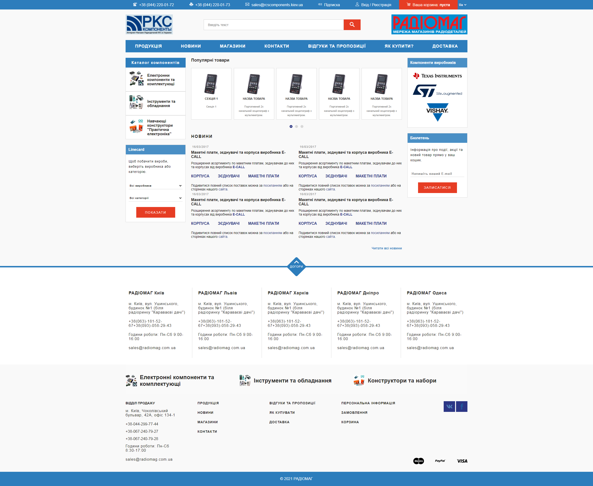
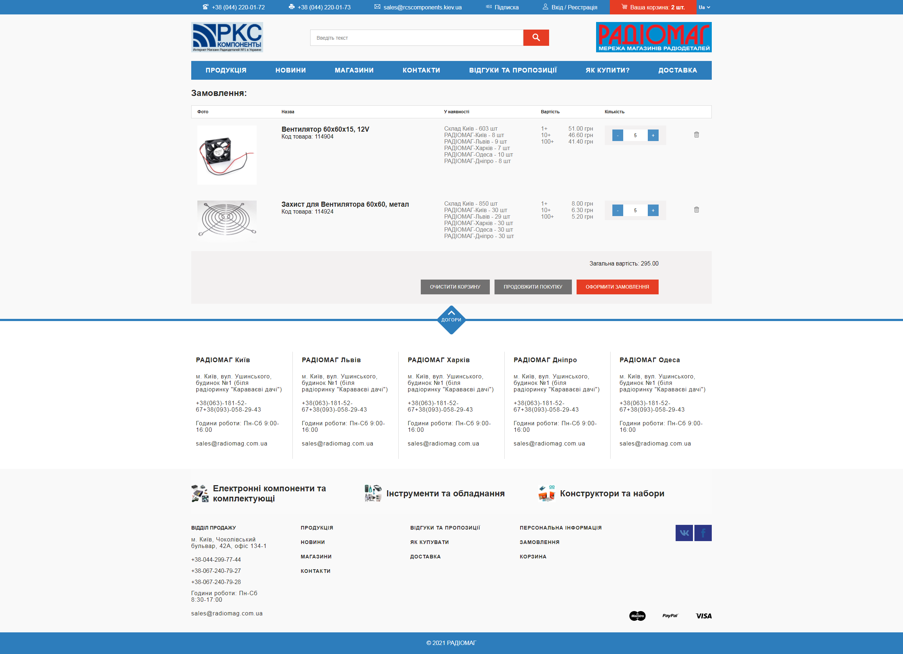
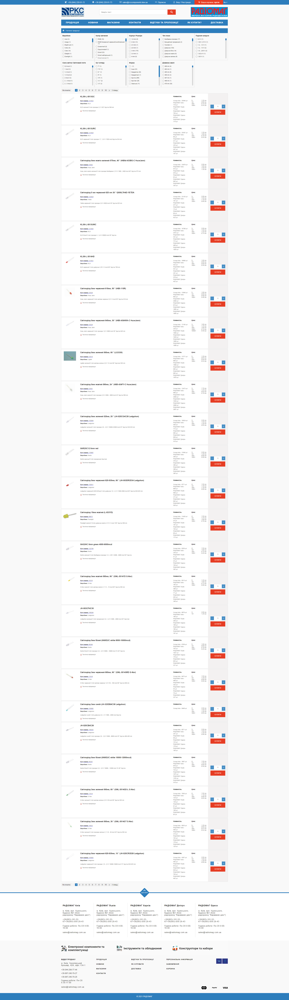

# radiomag - online-shop of electronics components  

SPA online shop build on Vue.js
This repositories contain two folder, one is client app(radiomag-client-vue) and 
second(radiomag-server-express) is only proxy server for get real products for group of electronics component.   

Client app built on Vue.js and Vue-router, Vuex, SCSS(SASS), BEM, localStorage, Web Worker.   

The following functionality is implemented:
- Main page 
- Group page
- Cart page
- Contacts page
- Model window
- Dynamic bread crumbs
- Background Web Worker in group page for work with data from server and no blocking page
- Save data in localStorage of products in cart when user close page and not make the order 
and restore data when user open shop page again   

Makefile containe all commands for development.  
For run application you need first run server and then run client.  
