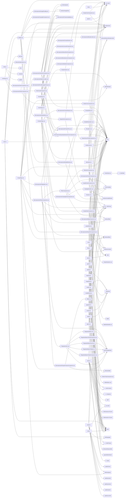

## Client

```mermaid
flowchart LR
App.vue-->vue-router("vue-router")
App.vue-->HeaderMain.vue("@/components/HeaderMain.vue")
App.vue-->Breadcrumbs.vue("@/components/Breadcrumbs.vue")
App.vue-->ModalWindow.vue("@/components/ModalWindow.vue")
App.vue-->ImageShowBig.vue("@/components/ImageShowBig.vue")
App.vue-->ShopInfoComponent.vue("@/components/ShopInfoComponent.vue")
App.vue-->FooterComponent.vue("@/components/FooterComponent.vue")
App.vue-->CopyrightComponent.vue("@/components/CopyrightComponent.vue")
App.vue-->cart("@/store/cart")
Breadcrumbs.vue-->breadcrumbs("@/store/breadcrumbs")
CardLineComponent.vue-->types("@/public/types")
CardLineComponent.vue-->vue("vue")
CardLineComponent.vue-->cart("@/store/cart")
CardLineComponent.vue-->goods("@/store/goods")
CardLineComponent.vue-->imageShow("@/store/imageShow")
CardLineComponent.vue-->ProductAvailability.vue("./ProductAvailability.vue")
CardLineComponent.vue-->ProductPrice.vue("./ProductPrice.vue")
CardLineComponent.vue-->QuantitySelectionFormComponent.vue("./QuantitySelectionFormComponent.vue")
CardSmall.vue-->Slider("../../../dto/Slider")
CatalogShortComponent.vue-->catalog("@/store/catalog")
CatalogShortComponent.vue-->CatalogShortItem.vue("./CatalogShortItem.vue")
CatalogShortItem.vue-->catalog("@/store/catalog")
CatalogShortItem.vue-->modalWindow("@/store/modalWindow")
ContactShop.vue-->vue("vue")
ContactShopList.vue-->ContactShop.vue("./ContactShop.vue")
FilterComponent.vue-->Group("../../../dto/Group")
FilterComponent.vue-->vue("vue")
FilterComponent.vue-->filtes("@/store/filtes")
FilterComponent.vue-->FilterItemComponent.vue("./FilterItemComponent.vue")
FilterItemComponent.vue-->Group("../../../dto/Group")
FilterItemComponent.vue-->vue("vue")
FilterItemComponent.vue-->filtes("@/store/filtes")
FiltersComponent.vue-->Group("../../../dto/Group")
FiltersComponent.vue-->filters("@/store/filters")
FiltersComponent.vue-->filtes("@/store/filtes")
FiltersComponent.vue-->FilterComponent.vue("./FilterComponent.vue")
FooterComponent.vue-->vue("vue")
FooterComponent.vue-->catalog("@/store/catalog")
FooterComponent.vue-->contacts("@/store/contacts")
HeaderCartComponent.vue-->vue-router("vue-router")
HeaderCartComponent.vue-->cart("@/store/cart")
HeaderInfoComponent.vue-->HeaderCartComponent.vue("./HeaderCartComponent.vue")
HeaderInfoComponent.vue-->LangChooseComponent.vue("./LangChooseComponent.vue")
HeaderMain.vue-->HeaderInfoComponent.vue("./HeaderInfoComponent.vue")
HeaderMain.vue-->HeaderSearch.vue("./HeaderSearch.vue")
HeaderMain.vue-->HeaderNavComponent.vue("./HeaderNavComponent.vue")
HeaderNavComponent.vue-->vue("vue")
HeaderNavComponent.vue-->i18n("@/store/i18n")
HeaderNavComponent.vue-->HeaderNavItem.vue("./HeaderNavItem.vue")
HeaderSearch.vue-->vue-router("vue-router")
HeaderSearch.vue-->HeaderSearchFieldComponent.vue("./HeaderSearchFieldComponent.vue")
HeaderSearchFieldComponent.vue-->vue("vue")
HeaderSearchFieldComponent.vue-->vue-router("vue-router")
HeaderSearchFieldComponent.vue-->i18n("@/store/i18n")
ImageShowBig.vue-->imageShow("@/store/imageShow")
LangChooseComponent.vue-->vue("vue")
LangChooseComponent.vue-->i18n("@/store/i18n")
Loader.vue-->httpClient("@/store/httpClient")
MapComponent.vue-->vue("vue")
MapComponent.vue-->leaflet("leaflet")
MapComponent.vue-->leaflet.css("leaflet/dist/leaflet.css")
ModalWindow.vue-->ModalWindowItem.vue("./ModalWindowItem.vue")
ModalWindow.vue-->modalWindow("@/store/modalWindow")
ModalWindowItem.vue-->vue("vue")
ModalWindowItem.vue-->vue-router("vue-router")
ModalWindowItem.vue-->modalWindow("@/store/modalWindow")
OrderCardComponent.vue-->cart("@/store/cart")
OrderCardComponent.vue-->cart("@/store/cart")
OrderCardComponent.vue-->ProductAvailability.vue("./ProductAvailability.vue")
OrderCardComponent.vue-->ProductPrice.vue("./ProductPrice.vue")
OrderCardComponent.vue-->QuantitySelectionFormComponent.vue("./QuantitySelectionFormComponent.vue")
OrderComponent.vue-->cart("@/store/cart")
OrderComponent.vue-->OrderCardComponent.vue("./OrderCardComponent.vue")
OrderComponent.vue-->OrderFormComponent.vue("./OrderFormComponent.vue")
OrderFormComponent.vue-->vue("vue")
OrderFormComponent.vue-->cart("@/store/cart")
Pagination.vue-->vue("vue")
Pagination.vue-->pagination("@/store/pagination")
Pagination.vue-->PaginationItem.vue("./PaginationItem.vue")
PaginationButton.vue-->pagination("@/store/pagination")
PaginationButtonToEndComponent.vue-->pagination("@/store/pagination")
PaginationButtonToLeft.vue-->pagination("@/store/pagination")
PaginationButtonToRight.vue-->pagination("@/store/pagination")
PaginationButtonToStartComponent.vue-->pagination("@/store/pagination")
PaginationItem.vue-->pagination("@/store/pagination")
PaginationItem.vue-->PaginationButtonToStartComponent.vue("./PaginationButtonToStartComponent.vue")
PaginationItem.vue-->PaginationButtonToLeft.vue("./PaginationButtonToLeft.vue")
PaginationItem.vue-->PaginationButton.vue("./PaginationButton.vue")
PaginationItem.vue-->PaginationButtonToRight.vue("./PaginationButtonToRight.vue")
PaginationItem.vue-->PaginationButtonToEndComponent.vue("./PaginationButtonToEndComponent.vue")
PopularProductsComponent.vue-->slider("@/store/slider")
PopularProductsComponent.vue-->Slider.vue("./Slider.vue")
PriceItem.vue-->vue("vue")
ProductPrice.vue-->PriceItem.vue("./PriceItem.vue")
QuantitySelectionFormComponent.vue-->vue("vue")
ShopInfoComponent.vue-->vue("vue")
ShopInfoComponent.vue-->contacts("@/store/contacts")
ShopInfoComponent.vue-->ButtonToUpComponent.vue("./ButtonToUpComponent.vue")
Slider.vue-->slider("@/store/slider")
Slider.vue-->CardSmall.vue("./CardSmall.vue")
Slider.vue-->SliderButton.vue("./SliderButton.vue")
index.ts-->Group("../../../dto/Group")
index.ts-->Contacts("../../../dto/Contacts")
index.ts-->endpoints("../../../endpoints")
index.ts-->GET("./GET")
index.ts-->vue-i18n("vue-i18n")
index.ts-->ua-UK.json("./dictionary/ua-UK.json")
index.ts-->en-US.json("./dictionary/en-US.json")
main.ts-->vue("vue")
main.ts-->pinia("pinia")
main.ts-->languages("@/languages")
main.ts-->App.vue("@/App.vue")
main.ts-->router("@/router")
main.ts-->stylescss("@/assets/styles/style.scss")
groupWorker.ts-->Group("../../../dto/Group")
groupWorker.ts-->types("./types")
groupWorker.ts-->Product("../../../dto/Product")
types.d.ts-->Product("../../../dto/Product")
types.d.ts-->Group("../../../dto/Group")
types.d.ts-->filters("../store/filters")
breadcrumbs.ts-->vue-router("vue-router")
breadcrumbs.ts-->breadcrumbs("@/store/breadcrumbs")
title.ts-->vue-router("vue-router")
beforeEach.ts-->vue-router("vue-router")
beforeEach.ts-->title("@/router/features/title")
beforeEach.ts-->breadcrumbs("@/router/features/breadcrumbs")
index.ts-->vue-router("vue-router")
index.ts-->beforeEach("./guards/beforeEach")
index.ts-->routes("./routes")
routes.ts-->home("./public/home")
routes.ts-->group("./public/group")
routes.ts-->product("./public/product")
routes.ts-->products("./public/products")
routes.ts-->search("./public/search")
routes.ts-->contacts("./public/contacts")
routes.ts-->cart("./public/cart")
routes.ts-->error404("./public/error404")
types.ts-->vue-router("vue-router")
breadcrumbs.ts-->vue("vue")
breadcrumbs.ts-->pinia("pinia")
cart.ts-->vue("vue")
cart.ts-->pinia("pinia")
catalog.ts-->vue("vue")
catalog.ts-->pinia("pinia")
catalog.ts-->httpClient("@/httpClient")
catalog.ts-->httpClient("@/store/httpClient")
contacts.ts-->vue("vue")
contacts.ts-->pinia("pinia")
contacts.ts-->Contacts("../../../dto/Contacts")
contacts.ts-->httpClient("@/httpClient")
filtes.ts-->filters("./filters")
filtes.ts-->vue("vue")
filtes.ts-->pinia("pinia")
goods.ts-->vue("vue")
goods.ts-->pinia("pinia")
group.ts-->Group("../../../dto/Group")
group.ts-->vue("vue")
group.ts-->pinia("pinia")
group.ts-->httpClient("../httpClient")
group.ts-->i18n("./i18n")
httpClient.ts-->vue("vue")
httpClient.ts-->pinia("pinia")
i18n.ts-->pinia("pinia")
i18n.ts-->vue-i18n("vue-i18n")
i18n.ts-->languages("@/languages")
imageShow.ts-->vue("vue")
imageShow.ts-->pinia("pinia")
index.js-->vuex("vuex")
index.js-->mutations("./mutations")
index.js-->getters("./getters")
modalWindow.ts-->vue("vue")
modalWindow.ts-->pinia("pinia")
pagination.ts-->vue("vue")
pagination.ts-->pinia("pinia")
slider.ts-->vue("vue")
slider.ts-->pinia("pinia")
slider.ts-->httpClient("../httpClient")
CartPage.vue-->cart("@/store/cart")
CartPage.vue-->OrderComponent.vue("@/components/OrderComponent.vue")
CartPage.vue-->OrderContactForm.vue("@/components/OrderContactForm.vue")
ContactsPage.vue-->vue("vue")
ContactsPage.vue-->contacts("@/store/contacts")
ContactsPage.vue-->ContactSection.vue("@/components/ContactSection.vue")
ContactsPage.vue-->MapComponent.vue("@/components/MapComponent.vue")
ContactsPage.vue-->ContactShopList.vue("@/components/ContactShopList.vue")
GoodsPage.vue-->vue("vue")
GoodsPage.vue-->goods("@/store/goods")
GoodsPage.vue-->cart("@/store/cart")
GoodsPage.vue-->ProductAvailability.vue("@/components/ProductAvailability.vue")
GoodsPage.vue-->ProductPrice.vue("@/components/ProductPrice.vue")
GoodsPage.vue-->QuantitySelectionFormComponent.vue("@/components/QuantitySelectionFormComponent.vue")
GroupPage.vue-->types("@/public/types")
GroupPage.vue-->Group("@/../../dto/Group")
GroupPage.vue-->filters("@/store/filters")
GroupPage.vue-->vue("vue")
GroupPage.vue-->vue-router("vue-router")
GroupPage.vue-->group("@/store/group")
GroupPage.vue-->pagination("@/store/pagination")
GroupPage.vue-->SpinnerLoader.vue("@/components/SpinnerLoader.vue")
GroupPage.vue-->Pagination.vue("@/components/Pagination.vue")
GroupPage.vue-->CardLineComponent.vue("@/components/CardLineComponent.vue")
GroupPage.vue-->ErrorMessageInGroup.vue("@/components/ErrorMessageInGroup.vue")
GroupPage.vue-->FiltersComponent.vue("@/components/FiltersComponent.vue")
HomePage.vue-->CatalogShortComponent.vue("@/components/CatalogShortComponent.vue")
HomePage.vue-->LinecardComponent.vue("@/components/LinecardComponent.vue")
HomePage.vue-->PopularProductsComponent.vue("@/components/PopularProductsComponent.vue")
HomePage.vue-->NewsShortComponent.vue("@/components/NewsShortComponent.vue")
HomePage.vue-->ManufacturersComponent.vue("@/components/ManufacturersComponent.vue")
HomePage.vue-->BulletinComponent.vue("@/components/BulletinComponent.vue")
Products.vue-->catalog("../store/catalog")
```
